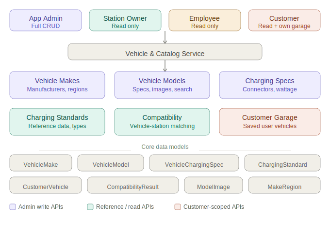

# vehicle-catalog-service

## Overview
This project is a Spring Boot application that provides a RESTful API for managing a vehicle catalog.

The Vehicle & Catalog Service is one of the most fundamental services in the platform — 
it is the single source of truth for every EV make, model, variant listing, battery spec, charging spec, connector standards, and customer vehicles.
It is created primarily by App Admin and read by every other service and actor/user. 
Here is the full breakdown across all six API groups.
It allows Admin to perform CRUD (Create, Read, Update, Delete) operations on vehicles, as well as search for vehicles based on various criteria.

It allows users to view the list of available vehicles and their details.

---

## 📑 Table of Contents
- [Overview](#overview)
- [Features](#features)
- [Tech Stack](#tech-stack)
- [Project Structure](#project-structure)
- [Architecture Overview](#architecture-overview)
- [Getting Started](#getting-started)
- [Configuration](#configuration)
- [API Endpoints](#api-endpoints)
- [Security](#security)
- [Data Models](#data-models)
- [Testing](#testing)

---

## Overview



## ✨ Features

- **Vehicle Make Management** — Full CRUD for EV manufacturers with soft-delete (cascades INACTIVE to child models), region associations, logo/website metadata, and country-of-origin filtering
- **Vehicle Model Management** — CRUD with body type, drive type, seating, model year, status toggling (ACTIVE / INACTIVE / DISCONTINUED), full-text search, and multi-image support (CDN URL + angle + primary flag)
- **Model Trim Management** — Manage trim grades per model (e.g. XE, XT, XZ+) with activation/deactivation
- **Battery Pack Management** — Define battery pack configurations per model (capacity kWh, chemistry, range)
- **Charging Configuration Management** — Configure onboard charger setups per model with nested charging specs (connector type, AC/DC, max wattage)
- **Charging Standards Reference Catalog** — Manage the global list of charging protocols (CCS2, CHAdeMO, Type 2, Bharat DC, etc.) with deprecation support and compatible-model lookups
- **Variant Listing (Sellable SKU)** — Compose a model + trim + battery pack + charging configuration into a unique, priced, orderable variant (e.g. "Tiago EV XZ+ 24 kWh 7.2 kW AC")
- **Compatibility Engine** — Query-only matchmaking that answers "can this vehicle charge at this station?" with achievable wattage and estimated charge time; supports bulk-check for internal services
- **Customer Garage** — Authenticated customers can save vehicles, set a primary vehicle, update nicknames/plates, and discover compatible charging stations
- **Pagination & Filtering** — All list endpoints are paginated and support multi-field filters (status, country, year, battery kWh, price range, connector type, etc.)
- **Full-Text Search** — Search vehicle models across make name, model name, and model year
- **OpenAPI / Swagger UI** — Auto-generated interactive API documentation via SpringDoc
- **Global Exception Handling** — Centralized `@ControllerAdvice` for structured JSON error responses (`ResourceNotFoundException`, `DuplicateResourceException`)
- **Entity Auditing** — Auto-populated `createdAt` and `updatedAt` fields via Hibernate `@CreationTimestamp` / `@UpdateTimestamp`
- **Soft Deletes** — Status-based deactivation for makes, models, trims, battery packs, charging configurations, and variant listings; nothing is hard-deleted from the catalog

---

## 🛠 Tech Stack

| Layer         | Technology                                        |
|---------------|---------------------------------------------------|
| Language      | Java 25                                           |
| Framework     | Spring Boot 4.0.5                                 |
| ORM           | Spring Data JPA / Hibernate                       |
| Database      | PostgreSQL                                        |
| Test Database | H2 (in-memory)                                    |
| Build         | Gradle                                            |
| API Docs      | SpringDoc OpenAPI 2.5.0 (Swagger UI)              |
| Utilities     | Lombok, Spring Validation, Spring Boot DevTools   |
| Testing       | JUnit 5, Spring Boot Test                         |

---

## 📁 Project Structure

```
vehicle-catalog-service/
└── src/
    ├── main/
    │   ├── java/com/pk/ev/vehicle/catalog/
    │   │   ├── VehicleCatalogServiceApplication.java        # Entry point
    │   │   ├── make/                                        # Group 1 — Vehicle Makes
    │   │   │   ├── controller/VehicleMakeController.java
    │   │   │   ├── model/         # VehicleMake, MakeRegion
    │   │   │   ├── dto/           # CreateMakeRequest, MakeResponse, ...
    │   │   │   ├── mapper/
    │   │   │   ├── repository/
    │   │   │   ├── service/
    │   │   │   └── enums/         # MakeStatus
    │   │   ├── model/                                       # Group 2 — Vehicle Models
    │   │   │   ├── controller/VehicleModelController.java
    │   │   │   ├── model/         # VehicleModel, ModelImage
    │   │   │   ├── dtos/
    │   │   │   ├── mapper/
    │   │   │   ├── repository/
    │   │   │   ├── service/
    │   │   │   └── enums/         # ModelStatus, BodyType, DriveType, ImageAngle
    │   │   ├── variant/                                     # Group 3 — Trims & Variant Listings
    │   │   │   ├── controller/    # ModelTrimController, VariantListingController
    │   │   │   ├── model/         # ModelTrim, VariantListing
    │   │   │   ├── dto/
    │   │   │   ├── mapper/
    │   │   │   ├── repository/
    │   │   │   ├── service/
    │   │   │   └── enums/         # VariantStatus
    │   │   ├── battery/                                     # Group 3 — Battery & Charging Config
    │   │   │   ├── controller/    # BatteryPackController, ChargingConfigurationController
    │   │   │   ├── model/         # BatteryPack, ChargingConfiguration
    │   │   │   ├── repository/
    │   │   │   └── enums/         # BatteryChemistry
    │   │   ├── chargingspec/                                # Charging Spec (nested under config)
    │   │   │   ├── model/         # VehicleChargingSpec
    │   │   │   ├── repository/
    │   │   │   └── enums/         # ConnectorType, CurrentType
    │   │   ├── chargingstandard/                            # Group 4 — Charging Standards
    │   │   │   ├── controller/ChargingStandardController.java
    │   │   │   ├── model/         # ChargingStandard
    │   │   │   ├── dto/
    │   │   │   ├── mapper/
    │   │   │   ├── repository/
    │   │   │   ├── service/
    │   │   │   └── enums/         # ChargingStandardType
    │   │   ├── compatibility/                               # Group 5 — Compatibility Engine
    │   │   │   ├── CompatibilityController.java
    │   │   │   ├── CompatibilityEngine.java
    │   │   │   ├── CompatibilityService.java / Impl
    │   │   │   ├── CompatibilityDtos.java
    │   │   │   └── StationConnector.java / Repository
    │   │   ├── customer/                                    # Group 6 — Customer Garage
    │   │   │   ├── controller/GarageController.java
    │   │   │   ├── domain/        # CustomerVehicle
    │   │   │   ├── dto/
    │   │   │   ├── mapper/
    │   │   │   ├── repository/
    │   │   │   └── service/
    │   │   └── exception/                                   # Global error handling
    │   │       ├── GlobalExceptionHandler.java
    │   │       ├── ResourceNotFoundException.java
    │   │       └── DuplicateResourceException.java
    │   └── resources/
    │       ├── application.yaml                             # Configuration
    │       └── db/                                         # DB migration scripts
    └── test/
        └── java/com/pk/ev/vehicle/catalog/
```

---

## 🏗 Architecture Overview

The application follows a clean layered architecture:

```
Client
  │
  ▼
Controller  (REST API layer — handles HTTP, delegates to service)
  │
  ▼
Service     (Business logic — interface + implementation)
  │
  ▼
Repository  (Spring Data JPA — talks to PostgreSQL)
  │
  ▼
PostgreSQL DB
```

All services are interface-driven, keeping the controllers decoupled from implementation details. DTOs are used to separate the API contract from internal entity models. The `CompatibilityEngine` is a dedicated component that performs matchmaking logic independently of the persistence layer.

---

## 🚀 Getting Started

### Prerequisites

- Java 25+
- Gradle
- PostgreSQL (running locally or on a remote host)

### Clone the Repository

```bash
git clone https://github.com/pavankiranmaddela/scaler-capstone-project.git
cd vehicle-catalog-service
```

### Configure the Application

Create or edit `src/main/resources/application.yaml` with your database credentials (see [Configuration](#configuration) below).

### Build and Run

```bash
# Build
gradlew clean build

# Run
gradlew bootRun
```

The application will start on `http://localhost:8080` by default.

Swagger UI is available at: `http://localhost:8080/swagger-ui.html`

---

## ⚙️ Configuration

Add the following to `src/main/resources/application.yaml`:

```yaml
spring:
  datasource:
    url: jdbc:postgresql://localhost:5432/vehicle_catalog_db
    username: your_db_username
    password: your_db_password
  jpa:
    hibernate:
      ddl-auto: update
    show-sql: true
```

> **Note:** Never commit real secrets to version control. Use environment variables or a secrets manager in production.

---

## 📡 API Endpoints

### Group 1 — Vehicle Makes

| Method   | Endpoint                          | Auth Required | Description                                      |
|----------|-----------------------------------|---------------|--------------------------------------------------|
| `POST`   | `/vehicle-makes`                  | Yes (Admin)   | Create a vehicle make (manufacturer)             |
| `GET`    | `/vehicle-makes`                  | No            | List all makes — paginated, filter by status/country |
| `GET`    | `/vehicle-makes/{makeId}`         | No            | Get full detail for a make                       |
| `PUT`    | `/vehicle-makes/{makeId}`         | Yes (Admin)   | Update name, logo, country, or status            |
| `DELETE` | `/vehicle-makes/{makeId}`         | Yes (Admin)   | Soft-delete (cascades INACTIVE to child models)  |
| `GET`    | `/vehicle-makes/{makeId}/models`  | No            | List all models under a make                     |
| `POST`   | `/vehicle-makes/{makeId}/regions` | Yes (Admin)   | Associate sale regions with a make               |
| `GET`    | `/vehicle-makes/{makeId}/regions` | No            | List all regions where this make is sold         |

### Group 2 — Vehicle Models

| Method   | Endpoint                                    | Auth Required | Description                                         |
|----------|---------------------------------------------|---------------|-----------------------------------------------------|
| `POST`   | `/vehicle-models`                           | Yes (Admin)   | Create a new vehicle model                          |
| `GET`    | `/vehicle-models`                           | No            | List models — paginated, filter by make/year/battery/connector/status |
| `GET`    | `/vehicle-models/search`                    | No            | Full-text search across make name, model name, year |
| `GET`    | `/vehicle-models/{modelId}`                 | No            | Get full detail including charging specs            |
| `PUT`    | `/vehicle-models/{modelId}`                 | Yes (Admin)   | Update model specs                                  |
| `DELETE` | `/vehicle-models/{modelId}`                 | Yes (Admin)   | Soft-delete (status → DISCONTINUED)                 |
| `PUT`    | `/vehicle-models/{modelId}/status`          | Yes (Admin)   | Toggle model status (ACTIVE / INACTIVE / DISCONTINUED) |
| `POST`   | `/vehicle-models/{modelId}/images`          | Yes (Admin)   | Upload a model image (CDN URL + angle + primary flag) |
| `GET`    | `/vehicle-models/{modelId}/images`          | No            | List all images for a model                         |
| `DELETE` | `/vehicle-models/{modelId}/images/{imageId}`| Yes (Admin)   | Remove a model image                                |

### Group 3 — Model Trims

| Method   | Endpoint                                          | Auth Required | Description                  |
|----------|---------------------------------------------------|---------------|------------------------------|
| `POST`   | `/vehicle-models/{modelId}/trims`                 | Yes (Admin)   | Add a trim grade to a model  |
| `GET`    | `/vehicle-models/{modelId}/trims`                 | No            | List trim grades for a model |
| `GET`    | `/vehicle-models/{modelId}/trims/{trimId}`        | No            | Get a trim by ID             |
| `PUT`    | `/vehicle-models/{modelId}/trims/{trimId}`        | Yes (Admin)   | Update a trim                |
| `DELETE` | `/vehicle-models/{modelId}/trims/{trimId}`        | Yes (Admin)   | Deactivate a trim            |

### Group 3 — Battery Packs

| Method   | Endpoint                                               | Auth Required | Description                        |
|----------|--------------------------------------------------------|---------------|------------------------------------|
| `POST`   | `/vehicle-models/{modelId}/battery-packs`              | Yes (Admin)   | Add a battery pack to a model      |
| `GET`    | `/vehicle-models/{modelId}/battery-packs`              | No            | List battery packs for a model     |
| `GET`    | `/vehicle-models/{modelId}/battery-packs/{packId}`     | No            | Get a battery pack by ID           |
| `PUT`    | `/vehicle-models/{modelId}/battery-packs/{packId}`     | Yes (Admin)   | Update a battery pack              |
| `DELETE` | `/vehicle-models/{modelId}/battery-packs/{packId}`     | Yes (Admin)   | Deactivate a battery pack          |

### Group 3 — Charging Configurations & Specs

| Method   | Endpoint                                                                     | Auth Required | Description                               |
|----------|------------------------------------------------------------------------------|---------------|-------------------------------------------|
| `POST`   | `/vehicle-models/{modelId}/charging-configurations`                          | Yes (Admin)   | Add a charging configuration to a model   |
| `GET`    | `/vehicle-models/{modelId}/charging-configurations`                          | No            | List charging configurations for a model  |
| `GET`    | `/vehicle-models/{modelId}/charging-configurations/{configId}`               | No            | Get a configuration with its specs        |
| `PUT`    | `/vehicle-models/{modelId}/charging-configurations/{configId}`               | Yes (Admin)   | Update a charging configuration           |
| `DELETE` | `/vehicle-models/{modelId}/charging-configurations/{configId}`               | Yes (Admin)   | Deactivate a charging configuration       |
| `POST`   | `/vehicle-models/{modelId}/charging-configurations/{configId}/specs`         | Yes (Admin)   | Add a charging spec to a configuration    |
| `GET`    | `/vehicle-models/{modelId}/charging-configurations/{configId}/specs`         | No            | List all specs for a configuration        |
| `GET`    | `/vehicle-models/{modelId}/charging-configurations/{configId}/specs/summary` | No            | Fastest AC + DC spec in a compact response |
| `GET`    | `/vehicle-models/{modelId}/charging-configurations/{configId}/specs/{specId}`| No            | Get a specific charging spec              |
| `PUT`    | `/vehicle-models/{modelId}/charging-configurations/{configId}/specs/{specId}`| Yes (Admin)   | Update a charging spec                    |
| `DELETE` | `/vehicle-models/{modelId}/charging-configurations/{configId}/specs/{specId}`| Yes (Admin)   | Remove a charging spec                    |

### Group 3 — Variant Listings (Sellable SKUs)

| Method   | Endpoint                                       | Auth Required | Description                                        |
|----------|------------------------------------------------|---------------|----------------------------------------------------|
| `POST`   | `/variant-listings`                            | Yes (Admin)   | Create a variant listing (Model + Trim + Battery + Charger) |
| `GET`    | `/variant-listings`                            | No            | Paginated, filterable list of all variant listings |
| `GET`    | `/variant-listings/{variantId}`                | No            | Get a variant listing with full detail             |
| `GET`    | `/variant-listings/by-model/{modelId}`         | No            | All variant listings for a specific model          |
| `PUT`    | `/variant-listings/{variantId}`                | Yes (Admin)   | Update price, status, or launch date               |
| `DELETE` | `/variant-listings/{variantId}`                | Yes (Admin)   | Soft-delete (status → DISCONTINUED)                |

### Group 4 — Charging Standards

| Method   | Endpoint                                                  | Auth Required | Description                                               |
|----------|-----------------------------------------------------------|---------------|-----------------------------------------------------------|
| `POST`   | `/charging-standards`                                     | Yes (Admin)   | Create a new charging standard                            |
| `GET`    | `/charging-standards`                                     | No            | List all standards — filterable by region/currentType/connector/deprecated |
| `GET`    | `/charging-standards/{standardId}`                        | No            | Get full detail for a charging standard by ID             |
| `GET`    | `/charging-standards/short-code/{shortCode}`              | No            | Get a standard by short code (e.g. CCS2, BDC)            |
| `PUT`    | `/charging-standards/{standardId}`                        | Yes (Admin)   | Update a charging standard                                |
| `DELETE` | `/charging-standards/{standardId}`                        | Yes (Admin)   | Deprecate a standard (soft delete, sets isDeprecated=true)|
| `GET`    | `/charging-standards/{standardId}/compatible-models`      | No            | List all variant listings compatible with this standard   |
| `GET`    | `/connector-types`                                        | No            | Flat list of all connector type enums with display metadata |
| `GET`    | `/charging-standards/regions`                             | No            | Distinct list of geographic regions for filter dropdowns  |
| `GET`    | `/charging-standards/governing-bodies`                    | No            | Distinct list of governing bodies for filter dropdowns    |

### Group 5 — Compatibility Engine

| Method  | Endpoint                                                        | Auth Required      | Description                                                    |
|---------|-----------------------------------------------------------------|--------------------|----------------------------------------------------------------|
| `GET`   | `/compatibility/vehicle/{variantListingId}/station/{stationId}` | No                 | Check if a vehicle variant can charge at a specific station    |
| `GET`   | `/compatibility/vehicle/{variantListingId}/connector/{connectorType}` | No           | Check if a vehicle variant supports a given connector type     |
| `GET`   | `/compatibility/station/{stationId}/vehicles`                   | No                 | List all vehicle variants compatible with a station            |
| `GET`   | `/compatibility/connector/{connectorType}/vehicles`             | No                 | List all vehicle variants compatible with a connector type     |
| `POST`  | `/compatibility/bulk-check`                                     | Yes (Admin/Internal)| Batch compatibility check for multiple variant + station pairs |

### Group 6 — Customer Garage

| Method   | Endpoint                                         | Auth Required     | Description                                                        |
|----------|--------------------------------------------------|-------------------|--------------------------------------------------------------------|
| `POST`   | `/garage/vehicles`                               | Yes (Customer)    | Add a vehicle to the customer's garage                             |
| `GET`    | `/garage/vehicles`                               | Yes (Customer)    | List all vehicles in the customer's garage                         |
| `GET`    | `/garage/vehicles/{vehicleId}`                   | Yes (Customer)    | Get a single saved vehicle by ID                                   |
| `PUT`    | `/garage/vehicles/{vehicleId}`                   | Yes (Customer)    | Update nickname, registration plate, or primary flag               |
| `DELETE` | `/garage/vehicles/{vehicleId}`                   | Yes (Customer)    | Remove a vehicle from the garage                                   |
| `PUT`    | `/garage/vehicles/{vehicleId}/set-primary`       | Yes (Customer)    | Mark this vehicle as the default for charging sessions             |
| `GET`    | `/garage/vehicles/{vehicleId}/compatible-stations`| Yes (Customer)   | Find charging stations compatible with this vehicle                |
| `GET`    | `/garage/vehicles/admin`                         | Yes (Admin)       | Paginated list of all garage entries across all users              |

---

## 🔒 Security

- **Role-based access** — Admin-only access for catalog mutation endpoints; Customer-scoped access for garage operations; Internal role for bulk-check
- **Ownership enforcement** — Customers can only view and modify their own garage entries
- **JWT authentication** — User identity extracted from the JWT subject claim

> **Note:** Spring Security and `@PreAuthorize` annotations are implemented and present in the code but currently commented out for local development convenience. They are production-ready to re-enable.

---

## 📊 Data Models

### Vehicle Make

| Field             | Type        | Notes                           |
|-------------------|-------------|---------------------------------|
| `id`              | UUID        | Auto-generated                  |
| `name`            | String      | Unique, not null                |
| `slug`            | String      | Auto-generated from name        |
| `countryOfOrigin` | String      | ISO 3166-1 alpha-2 (e.g. `IN`) |
| `logoUrl`         | String      | Optional                        |
| `websiteUrl`      | String      | Optional                        |
| `status`          | MakeStatus  | ACTIVE / INACTIVE               |
| `createdAt`       | Instant     | Auto-populated                  |
| `updatedAt`       | Instant     | Auto-populated                  |

### Vehicle Model

| Field            | Type        | Notes                                         |
|------------------|-------------|-----------------------------------------------|
| `id`             | UUID        | Auto-generated                                |
| `make`           | VehicleMake | Many-to-one                                   |
| `name`           | String      | Not null                                      |
| `modelYear`      | Integer     | Not null                                      |
| `bodyType`       | BodyType    | SEDAN, SUV, HATCHBACK, etc.                   |
| `driveType`      | DriveType   | FWD, RWD, AWD                                 |
| `seatingCapacity`| Integer     | Optional                                      |
| `weightKg`       | Integer     | Optional                                      |
| `status`         | ModelStatus | ACTIVE / INACTIVE / DISCONTINUED              |
| `createdAt`      | Instant     | Auto-populated                                |
| `updatedAt`      | Instant     | Auto-populated                                |

### Variant Listing (Sellable SKU)

| Field                    | Type               | Notes                                              |
|--------------------------|--------------------|----------------------------------------------------|
| `id`                     | UUID               | Auto-generated                                     |
| `model`                  | VehicleModel       | Many-to-one                                        |
| `trim`                   | ModelTrim          | Many-to-one (e.g. XE, XT, XZ+)                   |
| `batteryPack`            | BatteryPack        | Many-to-one (e.g. 19.2 kWh, 24 kWh)              |
| `chargingConfiguration`  | ChargingConfiguration | Many-to-one (e.g. 3.3 kW AC, 7.2 kW AC)       |
| `displayLabel`           | String             | Auto-built composite label (e.g. "Tiago EV XZ+ 24 kWh 7.2 kW AC") |
| `priceInr`               | BigDecimal         | Ex-showroom price                                  |
| `launchDate`             | LocalDate          | Optional                                           |
| `status`                 | VariantStatus      | ACTIVE / INACTIVE / DISCONTINUED                   |
| `createdAt`              | Instant            | Auto-populated                                     |
| `updatedAt`              | Instant            | Auto-populated                                     |

### Charging Standard

| Field            | Type                  | Notes                                  |
|------------------|-----------------------|----------------------------------------|
| `id`             | UUID                  | Auto-generated                         |
| `name`           | String                | Unique, not null (e.g. "CCS Combo 2") |
| `shortCode`      | String                | Unique, uppercased (e.g. "CCS2")      |
| `connectorType`  | ConnectorType         | CCS2, TYPE2, CHAdeMO, BHARAT_DC, etc. |
| `currentType`    | ChargingStandardType  | AC / DC / BOTH                         |
| `region`         | String                | e.g. India, Europe, Global            |
| `governingBody`  | String                | e.g. BIS, CharIN, IEC                 |
| `isDeprecated`   | Boolean               | Soft-delete flag                       |

---

## 🧪 Testing

Run all tests with:

```bash
gradlew test
```

Tests use an H2 in-memory database so no external PostgreSQL instance is required.

---

## 👤 Author

**Pavan Kiran Maddela** — Scaler Neovarsity Capstone Project